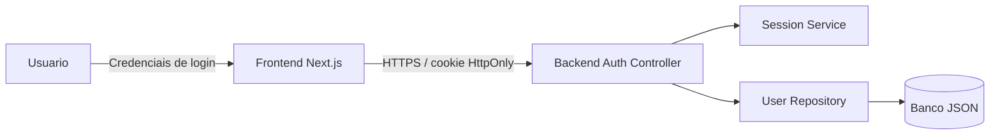
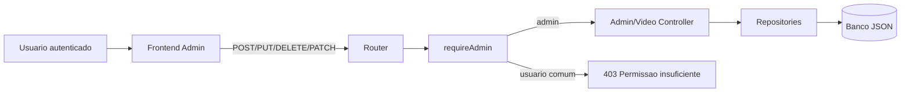
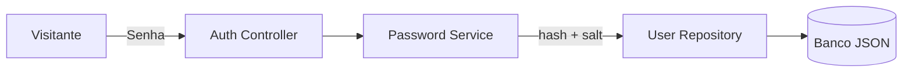

# Relatorio RA2 - EducaFlix

## Contas padrao para avaliacao

Use estas contas para acessar o sistema durante a avaliacao:

| Perfil | E-mail | Senha |
| --- | --- | --- |
| Administrador | `admin@educaflix.local` | `Admin@12345` |
| Usuario comum | `aluno@educaflix.local` | `Aluno@12345` |

## Sistema

O EducaFlix e uma plataforma web educacional para cadastro, autenticacao, busca, filtragem, visualizacao e avaliacao de videos educacionais. O modelo de dominio principal e `Video Educacional`.

## Atores

- Visitante: acessa tela inicial e cadastro.
- Usuario autenticado: pesquisa videos, visualiza detalhes e gerencia suas avaliacoes.
- Administrador: cadastra, edita e remove videos; altera status de usuarios.
- Banco de Dados EducaFlix: arquivo JSON acessado somente pela camada Repository/DAO.
- Sistema Web EducaFlix: frontend Next.js e backend Node.js.

## Modelo de dominio principal

Video Educacional:

- `id`
- `titulo`
- `descricao`
- `categoria`
- `tema`
- `nivel`
- `duracaoMinutos`
- `link`
- `status`
- `mediaAvaliacoes`

Relacionamentos:

- Um video possui varias avaliacoes.
- Uma avaliacao pertence a um unico video e a um unico usuario.
- Apenas administradores alteram o catalogo.

## Requisitos de seguranca

### A1 - Protecao de credenciais, cookies e dados sensiveis em transito

Implementacao:

- `backend/src/middlewares/securityHeaders.js`
- `backend/src/utils/http.js`
- `backend/src/controllers/authController.js`

O cookie de sessao e `HttpOnly` e `SameSite=Lax`; o atributo `Secure` e aplicado quando a aplicacao recebe `x-forwarded-proto: https`. Foram adicionados cabecalhos `X-Content-Type-Options`, `X-Frame-Options`, `Referrer-Policy` e `Content-Security-Policy`.

DFD:



### A2 - Funcoes administrativas apenas para administradores

Implementacao:

- `backend/src/middlewares/authMiddleware.js`
- `backend/src/routes/index.js`
- `frontend/app/admin/page.jsx`

Rotas administrativas chamam `requireAdmin`. Usuarios sem perfil `admin` recebem HTTP 403.

DFD:



### A3 - Senhas com hash e salt

Implementacao:

- `backend/src/services/passwordService.js`
- `backend/src/controllers/authController.js`
- `backend/src/database/jsonDatabase.js`

Senhas sao armazenadas com PBKDF2, salt individual e comparacao por `timingSafeEqual`.

DFD:



### B1 - Validacao backend

Referencia: OWASP ASVS v5.0.0-2.2.1 e v5.0.0-2.2.2.

Implementacao:

- `backend/src/validators/schemas.js`

Valida cadastro, login, video, avaliacao, status de usuario e filtros de busca com regras de tipo, tamanho, formato e valores permitidos.

### B2 - Acesso seguro aos dados

Referencia: OWASP ASVS v5.0.0-1.2.4.

Implementacao:

- `backend/src/repositories/userRepository.js`
- `backend/src/repositories/videoRepository.js`
- `backend/src/repositories/reviewRepository.js`
- `backend/src/database/jsonDatabase.js`

O MVP usa JSON local em vez de SQL. Todo acesso ao arquivo de dados passa pelos repositories, evitando manipulacao direta de persistencia nos controllers ou views.

### B3 - Saida segura contra XSS

Referencia: OWASP ASVS v5.0.0-5.1.3.

Implementacao:

- `backend/src/services/sanitizer.js`
- `frontend/app/videos/[id]/page.jsx`

Campos textuais sao sanitizados no backend. O frontend exibe comentarios por interpolacao React, sem `dangerouslySetInnerHTML`.

### C1 - Bloqueio de tentativas de login

Referencia: OWASP ASVS v5.0.0-6.1.1 e v5.0.0-6.3.1.

Implementacao:

- `backend/src/services/loginAttemptService.js`
- `backend/src/controllers/authController.js`

Apos 5 falhas em 15 minutos para mesmo e-mail/IP, novas tentativas sao bloqueadas por 15 minutos com mensagem generica.

### C2 - Protecao CSRF

Referencia: OWASP ASVS v5.0.0-3.5.1 e v5.0.0-3.5.3.

Implementacao:

- `backend/src/middlewares/authMiddleware.js`
- `frontend/lib/api.js`

Requisicoes autenticadas que alteram dados exigem `X-CSRF-Token`.

### C3 - Invalidacao de sessao

Referencia: OWASP ASVS v5.0.0-7.4.1 e v5.0.0-7.4.2.

Implementacao:

- `backend/src/services/sessionService.js`
- `backend/src/controllers/authController.js`
- `backend/src/controllers/adminController.js`

Logout invalida sessao. Bloqueio de conta invalida todas as sessoes do usuario.

### C4 - Erros genericos

Referencia: OWASP ASVS v5.0.0-16.5.1.

Implementacao:

- `backend/src/app.js`
- controllers em `backend/src/controllers`

Erros inesperados retornam mensagem generica e nao expoem stack trace, caminhos internos, tokens ou detalhes do banco.

## MVC

| Camada | Responsabilidade | Arquivos |
| --- | --- | --- |
| Model | Entidades, regras de negocio, validacao e acesso a dados | `backend/src/services`, `backend/src/validators`, `backend/src/repositories` |
| View | Telas e formularios | `frontend/app`, `frontend/components` |
| Controller | Fluxo entre requisicoes e model | `backend/src/controllers` |
| DAO | Persistencia CRUD | `backend/src/repositories`, `backend/src/database/jsonDatabase.js` |

## Design Patterns

| Pattern | Onde foi aplicado | Justificativa |
| --- | --- | --- |
| MVC | Backend controllers/model e frontend views | Separa responsabilidades e facilita manutencao. |
| Repository/DAO | `userRepository`, `videoRepository`, `reviewRepository` | Isola persistencia e CRUD. |
| Singleton | `jsonDatabase.js` | Centraliza o arquivo de dados usado pela aplicacao. |
| Strategy | `validators/schemas.js` | Cada caso de uso possui estrategia propria de validacao. |
| Facade | `frontend/lib/api.js` | Centraliza fetch, cookies, CSRF e erros no frontend. |

## Evidencias de execucao

Comandos executados com sucesso:

```bash
node -c server.js
npm run build
```

Fluxos testados via API:

- Health check.
- Login administrador.
- Consulta de sessao.
- CRUD administrativo de video.
- Cadastro de usuario.
- Login de usuario comum.
- Publicacao de avaliacao.
- Bloqueio 403 para usuario comum tentando acessar rota administrativa.

## Contas padrao para acesso rapido

| Perfil | E-mail | Senha |
| --- | --- | --- |
| Administrador | `admin@educaflix.local` | `Admin@12345` |
| Usuario comum | `aluno@educaflix.local` | `Aluno@12345` |
